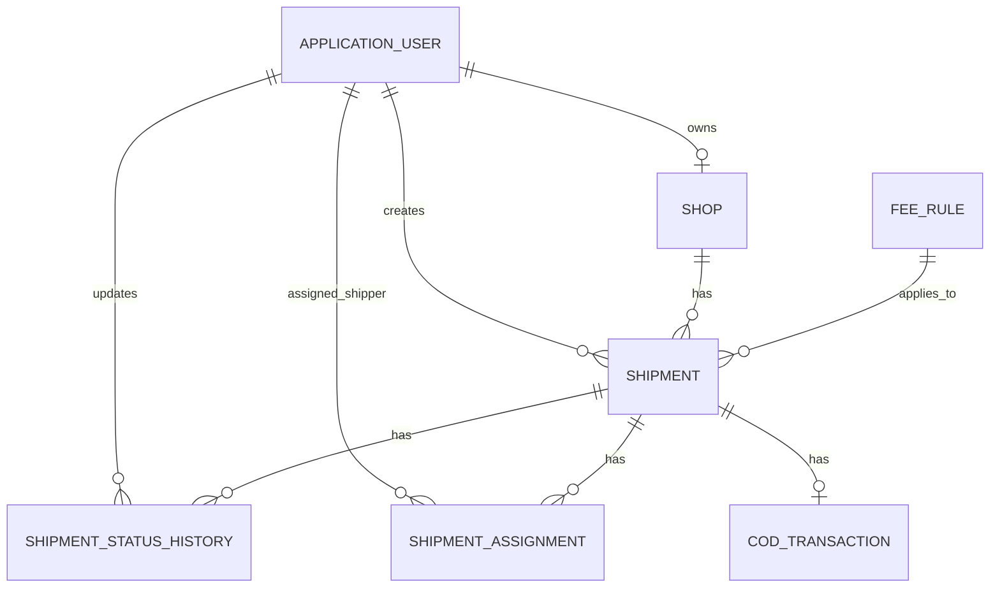

Dưới đây là nội dung cô đọng, đúng trọng tâm cho file:

# `.agent/database.md`

# Database Design

## Approach

Use **Code First** with **Entity Framework Core** and **SQL Server**.

Reason:

- Fits Clean Architecture.
- Works well with Domain-driven design.
- Easy to manage schema changes using migrations.
- Suitable for MVP development.
- Keeps database schema aligned with domain model.

Do not use Database First unless working with an existing legacy database.

---

# Database Principles

- Use SQL Server.
- Use EF Core Code First.
- Use Fluent API configuration.
- Use `IEntityTypeConfiguration<T>` for entity mapping.
- Use GUID primary keys.
- Use UTC datetime.
- Configure decimal precision explicitly.
- Store enum values as string for readability.
- Avoid lazy loading.
- Avoid business logic in `DbContext`.
- Avoid direct database access from Blazor components.
- Use migrations for schema changes.

---

# Core Tables

```text
AspNetUsers
AspNetRoles
Shops
Shipments
ShipmentAssignments
ShipmentStatusHistories
CodTransactions
FeeRules
```

---

# Identity Tables

Use **ASP.NET Core Identity** for authentication and authorization.

Default Identity tables:

```text
AspNetUsers
AspNetRoles
AspNetUserRoles
AspNetUserClaims
AspNetRoleClaims
AspNetUserLogins
AspNetUserTokens
```

Extend `ApplicationUser` with:

| Column | Type | Note |
|---|---|---|
| Id | uniqueidentifier | Primary key |
| FullName | nvarchar(150) | User full name |
| Email | nvarchar(256) | Login email |
| PhoneNumber | nvarchar(20) | Phone number |
| IsActive | bit | Account status |
| CreatedAt | datetime2 | Created time |

---

# Shops

Represents a sender/shop account.

## Relationship

```text
ApplicationUser 1 - 0..1 Shop
Shop 1 - N Shipments
```

## Columns

| Column | Type | Note |
|---|---|---|
| Id | uniqueidentifier | Primary key |
| OwnerUserId | uniqueidentifier | FK to AspNetUsers |
| Name | nvarchar(200) | Shop name |
| PhoneNumber | nvarchar(20) | Shop phone |
| AddressLine | nvarchar(300) | Detail address |
| Ward | nvarchar(100) | Ward |
| District | nvarchar(100) | District |
| Province | nvarchar(100) | Province |
| IsActive | bit | Shop status |
| CreatedAt | datetime2 | Created time |
| UpdatedAt | datetime2 | Updated time |

## Indexes

```text
IX_Shops_OwnerUserId
IX_Shops_PhoneNumber
```

---

# Shipments

Central table of the system.

## Relationship

```text
Shop 1 - N Shipments
FeeRule 1 - N Shipments
Shipment 1 - N ShipmentAssignments
Shipment 1 - N ShipmentStatusHistories
Shipment 1 - 0..1 CodTransaction
```

## Columns

| Column | Type | Note |
|---|---|---|
| Id | uniqueidentifier | Primary key |
| TrackingCode | nvarchar(30) | Unique tracking code |
| ShopId | uniqueidentifier | FK to Shops |
| CreatedByUserId | uniqueidentifier | FK to AspNetUsers |
| FeeRuleId | uniqueidentifier/null | FK to FeeRules |
| SenderName | nvarchar(150) | Sender name |
| SenderPhone | nvarchar(20) | Sender phone |
| SenderAddressLine | nvarchar(300) | Pickup address |
| SenderWard | nvarchar(100) | Sender ward |
| SenderDistrict | nvarchar(100) | Sender district |
| SenderProvince | nvarchar(100) | Sender province |
| ReceiverName | nvarchar(150) | Receiver name |
| ReceiverPhone | nvarchar(20) | Receiver phone |
| ReceiverAddressLine | nvarchar(300) | Delivery address |
| ReceiverWard | nvarchar(100) | Receiver ward |
| ReceiverDistrict | nvarchar(100) | Receiver district |
| ReceiverProvince | nvarchar(100) | Receiver province |
| WeightInKg | decimal(10,2) | Package weight |
| GoodsValue | decimal(18,2) | Goods value |
| CodAmount | decimal(18,2) | COD amount |
| ShippingFee | decimal(18,2) | Shipping fee |
| RouteType | nvarchar(50) | Route type |
| CurrentStatus | nvarchar(50) | Current shipment status |
| Note | nvarchar(500) | Shipment note |
| CreatedAt | datetime2 | Created time |
| UpdatedAt | datetime2 | Updated time |
| CancelledAt | datetime2/null | Cancelled time |
| DeliveredAt | datetime2/null | Delivered time |

## Indexes

```text
UX_Shipments_TrackingCode
IX_Shipments_ShopId
IX_Shipments_CurrentStatus
IX_Shipments_CreatedAt
IX_Shipments_ReceiverPhone
```

## Rules

- `TrackingCode` must be unique.
- `WeightInKg` must be greater than 0.
- `GoodsValue` must be greater than or equal to 0.
- `CodAmount` must be greater than or equal to 0.
- `ShippingFee` must be greater than or equal to 0.
- Shipment address should be stored as snapshot data.
- Do not normalize shipment sender/receiver address into separate tables for MVP.

---

# ShipmentAssignments

Stores shipper assignment history.

## Relationship

```text
Shipment 1 - N ShipmentAssignments
ApplicationUser 1 - N ShipmentAssignments as Shipper
ApplicationUser 1 - N ShipmentAssignments as Assigner
```

## Columns

| Column | Type | Note |
|---|---|---|
| Id | uniqueidentifier | Primary key |
| ShipmentId | uniqueidentifier | FK to Shipments |
| ShipperUserId | uniqueidentifier | FK to AspNetUsers |
| AssignedByUserId | uniqueidentifier | FK to AspNetUsers |
| IsActive | bit | Current active assignment |
| AssignedAt | datetime2 | Assigned time |
| UnassignedAt | datetime2/null | Unassigned time |
| Note | nvarchar(500) | Assignment note |

## Indexes

```text
IX_ShipmentAssignments_ShipmentId
IX_ShipmentAssignments_ShipperUserId
IX_ShipmentAssignments_IsActive
UX_ShipmentAssignments_ActiveShipment
```

## Rules

- One shipment can only have one active assignment.
- Only active shipper can be assigned.
- Keep assignment history instead of overwriting old assignment.

---

# ShipmentStatusHistories

Stores tracking timeline of a shipment.

## Relationship

```text
Shipment 1 - N ShipmentStatusHistories
ApplicationUser 1 - N ShipmentStatusHistories
```

## Columns

| Column | Type | Note |
|---|---|---|
| Id | uniqueidentifier | Primary key |
| ShipmentId | uniqueidentifier | FK to Shipments |
| FromStatus | nvarchar(50) | Previous status |
| ToStatus | nvarchar(50) | New status |
| Note | nvarchar(500) | Status update note |
| UpdatedByUserId | uniqueidentifier | FK to AspNetUsers |
| CreatedAt | datetime2 | Update time |

## Indexes

```text
IX_ShipmentStatusHistories_ShipmentId_CreatedAt
IX_ShipmentStatusHistories_UpdatedByUserId
```

## Rules

- Every shipment status change must create one history record.
- Tracking page reads data from this table.
- Do not update old history records except for technical correction.

---

# CodTransactions

Stores COD lifecycle.

## Relationship

```text
Shipment 1 - 0..1 CodTransaction
ApplicationUser 1 - N CodTransactions as Collector
ApplicationUser 1 - N CodTransactions as Settler
```

## Columns

| Column | Type | Note |
|---|---|---|
| Id | uniqueidentifier | Primary key |
| ShipmentId | uniqueidentifier | FK to Shipments |
| Amount | decimal(18,2) | COD amount |
| Status | nvarchar(50) | COD status |
| CollectedByUserId | uniqueidentifier/null | Shipper who collected COD |
| CollectedAt | datetime2/null | Collection time |
| SettledByUserId | uniqueidentifier/null | User who settled COD |
| SettledAt | datetime2/null | Settlement time |
| CreatedAt | datetime2 | Created time |
| UpdatedAt | datetime2 | Updated time |

## Indexes

```text
UX_CodTransactions_ShipmentId
IX_CodTransactions_Status
IX_CodTransactions_CollectedAt
```

## Rules

- One shipment can only have one COD transaction.
- If COD amount is 0, status is `NotRequired`.
- If COD amount > 0, status is `PendingCollection`.
- COD can only be marked as `Collected` when shipment is `Delivered`.
- Only Admin or Operator can mark COD as `Settled`.

---

# FeeRules

Stores simple shipping fee configuration.

## Relationship

```text
FeeRule 1 - N Shipments
```

## Columns

| Column | Type | Note |
|---|---|---|
| Id | uniqueidentifier | Primary key |
| RouteType | nvarchar(50) | Route type |
| BaseFee | decimal(18,2) | Base shipping fee |
| ExtraFeePerKg | decimal(18,2) | Extra fee per kg |
| WeightThresholdKg | decimal(10,2) | Weight threshold |
| IsActive | bit | Active status |
| CreatedAt | datetime2 | Created time |
| UpdatedAt | datetime2 | Updated time |

## Indexes

```text
IX_FeeRules_RouteType_IsActive
```

## Rules

- Use simple fee calculation for MVP.
- Do not implement complex real-world logistics pricing.
- Only active fee rules are used for calculation.

---

# Enums

## ShipmentStatus

```csharp
public enum ShipmentStatus
{
    PendingPickup = 1,
    Assigned = 2,
    PickingUp = 3,
    PickedUp = 4,
    InTransit = 5,
    Delivering = 6,
    Delivered = 7,
    DeliveryFailed = 8,
    Returned = 9,
    Cancelled = 10
}
```

## CodStatus

```csharp
public enum CodStatus
{
    NotRequired = 1,
    PendingCollection = 2,
    Collected = 3,
    Settled = 4
}
```

## RouteType

```csharp
public enum RouteType
{
    SameProvince = 1,
    SameRegion = 2,
    InterRegion = 3,
    InterProvince = 4
}
```

---

# ERD



---

# Seed Data

## Roles

```text
Admin
Operator
Shop
Shipper
```

## Demo Users

```text
admin@minilogistics.local
operator@minilogistics.local
shop@minilogistics.local
shipper@minilogistics.local
```

## Fee Rules

| RouteType | BaseFee | ExtraFeePerKg | WeightThresholdKg |
|---|---:|---:|---:|
| SameProvince | 20000 | 5000 | 1 |
| SameRegion | 30000 | 6000 | 1 |
| InterRegion | 45000 | 8000 | 1 |
| InterProvince | 60000 | 10000 | 1 |

---

# Migration Plan

## Migration 1: Identity

- Add ASP.NET Core Identity.
- Extend `ApplicationUser`.
- Seed roles.
- Seed admin account.

## Migration 2: Core Logistics Tables

- Shops
- Shipments
- ShipmentAssignments
- ShipmentStatusHistories
- CodTransactions
- FeeRules

## Migration 3: Constraints and Indexes

- Unique tracking code.
- Unique active assignment per shipment.
- Unique COD transaction per shipment.
- Decimal precision.
- Status indexes.

---

# Anti-patterns to Avoid

- Database First for this MVP.
- Business logic in `DbContext`.
- Direct `DbContext` usage in Blazor components.
- Public setters that allow invalid entity states.
- Over-normalizing address tables.
- Adding complex pricing tables too early.
- Adding payment tables before COD workflow is stable.
````
