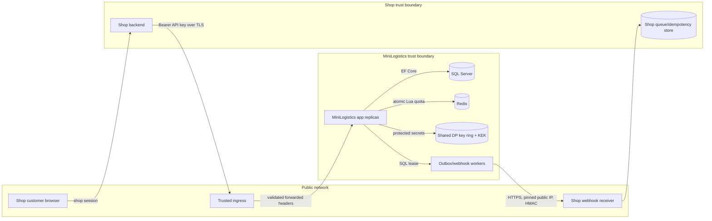

# Partner API and Webhook Threat Model

Status: implementation reviewed in repository; independent staging security review
is still required before public production.

## Data Flow and Trust Boundaries

Secrets crossing a boundary are the Partner API key and webhook HMAC signature. The
webhook signing secret is entered through the authenticated portal, encrypted at
rest, and never sent back to the portal after storage.

## Threats and Controls

| Threat | Attack | Implemented control | Remaining verification |
| --- | --- | --- | --- |
| Credential theft | Key in browser, source, logs, or leaked DB | Backend-only contract, one-time key display, SHA-256 at rest, environment prefix, revoke/rotate, masked logs | Secret-manager and log scan in staging |
| IDOR | Shop A probes Shop B tracking codes | Query by `trackingCode + ShopId`; uniform `404`; cross-shop contract tests | External penetration test |
| Cross-client leakage | Client B reads client A external ID | Reference lookup is current-client only; nullable `externalOrderId` | Contract review |
| Unauthorized writes | Client B cancels client A shipment | Cancel still requires same-client external reference | IDOR regression suite |
| SSRF | Webhook targets loopback/private/metadata | HTTPS and port allowlist, all A/AAAA validated, private/reserved/metadata blocked, validation before save and send | Egress firewall test |
| DNS rebinding | Public DNS changes to private at connect | Resolve and validate inside `SocketsHttpHandler.ConnectCallback`; connect to validated IP | Controlled staging DNS test |
| Redirect pivot | Public endpoint redirects internally | Automatic redirects disabled | Staging sink test |
| Response exhaustion | Large headers/body or slow receiver | Header/body limits, request/connect timeout, connection cap, response streaming | Soak and timeout chaos test |
| Proxy spoofing | Direct caller injects `X-Forwarded-For` | Explicit `KnownProxies`/`KnownNetworks`, symmetry, hop limit | Real ingress fixture |
| Rate-limit bypass | Requests spread over replicas | Redis atomic Lua increment/expiry keyed by env/client/action/window | Two-replica Redis load test |
| Redis outage | Quota lookup blocks or silently bypasses writes | Short timeout/circuit breaker; create/cancel fail closed; quote/tracking fail open with metrics | Redis failover drill |
| Duplicate workers | Replicas claim the same row | SQL atomic claim, row locks, rowversion, lease and event ID uniqueness | Multi-worker soak test |
| Worker crash | Row remains permanently processing | Expiring lease and reclaim test | Kill/restart staging test |
| Duplicate/out-of-order webhook | Receiver applies stale state | At-least-once contract, `eventId`, `changedAtUtc`, signed payload/version headers | Partner receiver certification |
| Replay | Captured signed request resent | Receiver must enforce timestamp window and unique `eventId` | Receiver fixture/security test |
| Timeline leakage | Free-form note contains PII/token/GPS | Public deterministic mapper never reads internal note; PII tests | Privacy sign-off |
| Key-ring loss | Restart cannot decrypt webhook secret | Shared persisted key ring, fixed app name, KEK/certificate, readiness round-trip | Backup/restore and rolling deployment drill |
| Audit leakage | Error/body contains credentials or PII | Request body not stored; webhook body discarded; generic outbound errors; trace IDs | Central log scan |

## Abuse and Failure Policies

- Authentication, scope, IP, and ownership checks execute before business operations.
- `401` and `403` do not echo key material. Cross-tenant shipment misses use `404`.
- Create uses an idempotency key and payload hash. A reused key with different content
  returns conflict.
- Webhook receivers should allow at most five minutes of clock skew, compare HMAC in
  constant time, and persist `eventId` under a unique constraint before acknowledging.
- Failed and dead-lettered queue rows are not removed by retention. Manual retry is
  authorized by API client scope and audited.

## Logging Rules

Never log raw Bearer keys, signing secrets, protected secret blobs, full request
bodies, receiver/sender contact data, addresses, GPS, webhook response bodies, or
webhook URLs containing credentials. Use API client ID, delivery/event ID, status,
error category, and correlation ID.

## Release-Gate Tests

Repository tests cover authorization, public mapping, DNS/IP policy, proxy spoofing,
Data Protection sharing, atomic-store races, SQL leases, secret rotation, health, and
contract artifacts. The following require production-like staging: egress firewall,
real ingress chain, managed Redis failover, KMS/volume restore, container/dependency
scan, load/soak, rolling restart, alert routing, and independent security sign-off.
